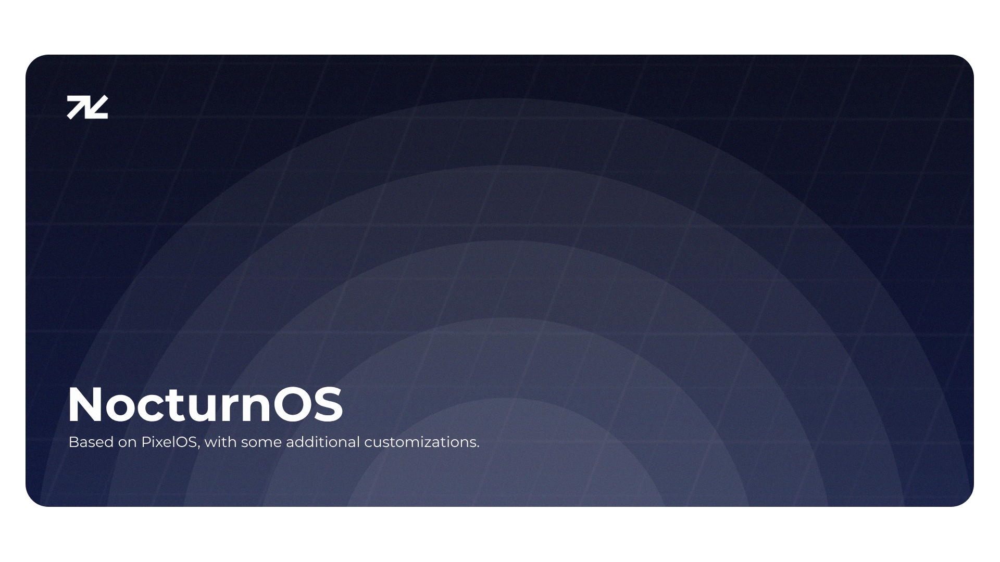

# NocturnOS

In the darkest hours of the night, a new light emerges quietly. NocturnOS, forged under the moonlit sky, is designed to embrace silence and stability. Welcome to Veluna — the first star that leads you Into the NocturnOS.

[More build information](https://github.com/NocturnOS-Project/manifest)

### Special Thanks to
- **[AOSP](https://android.googlesource.com)**
- **[PixelOS](https://github.com/PixelOS-AOSP)**
- **[LineageOS](https://lineageos.org/)** 
- **[FortuneOS](https://github.com/fortuneOS-AOSP)** 
- **[AxionAOSP](https://github.com/AxionAOSP)** 
- **[crDroid](https://github.com/crdroidandroid)** 
- **[TheParasiteProject](https://github.com/TheParasiteProject)** 
- And all rom developers.
